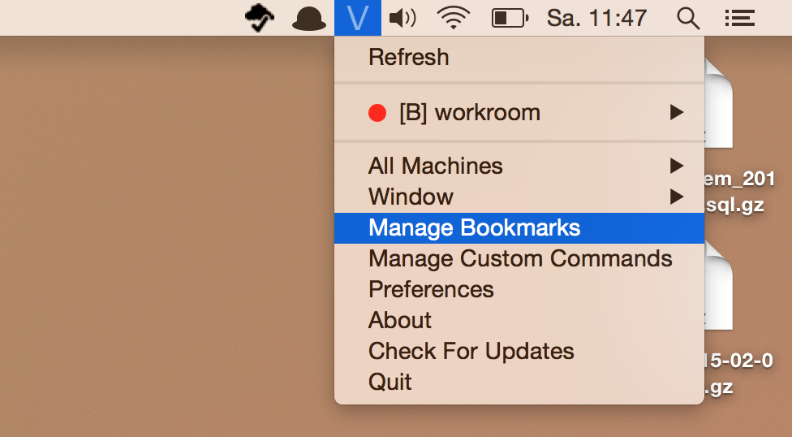
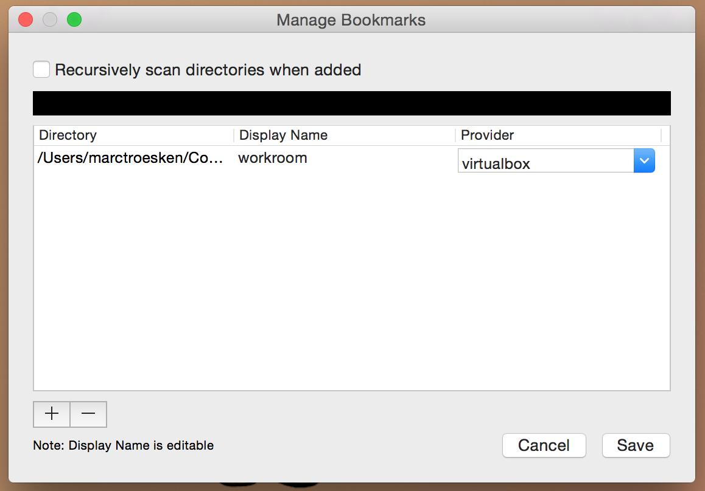
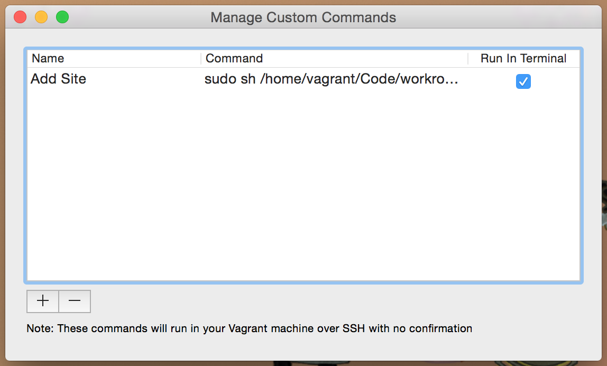

# Easy development with Workroom
Workroom is an easy Vagrant development environment with an additional serve script.  
Don´t worry about environments, stay focused on your code!

## Installation
Fist download the workroom folder and place it where you store your projects.
> [Download workroom](https://github.com/MarcTroesken/workroom/archive/v1.2.zip)

### Vagrant
You need to have Vagrant installed.  
Get it right here [https://www.vagrantup.com/downloads.html](https://www.vagrantup.com/downloads.html)

### Virtual Box
Install the latest version of Virtualbox.  
Here [https://www.virtualbox.org/wiki/Downloads](https://www.virtualbox.org/wiki/Downloads)

### Vagrant Manager
For managing our development enviroments download and install 
[Vagrant Manager](https://github.com/lanayotech/vagrant-manager/releases/download/2.3.0/vagrant-manager-2.3.0.dmg)

## First Steps
Add your workroom folder to `Bookmarks`in Vagrant Manger.  
Click the Vagrant Manager icon in your status bar an select `Manage Bookmarks`.  

Search for your workroom folder an select it.

Save your settings. After that you´ll see your workroom environment showing up in Vagrant Manager.
Hover over it and by clicking `Up` the environent boots and is ready for use.

## Add Sites
For adding websites to your virtual machine just add the `serve.sh` script to Vagrant Manager´s Custom Commands. Click `Manage Custom Commands` and type the following:  
 
Name: `Add Site` _(Or what ever you would like to name it)_  
Command: `sudo sh /home/vagrant/Code/workroom/serve.sh`  
Run in Terminal: check that
  

 

After your machine is running, just hover over your virtual machine in Vagrant Manager an select the `Custom Command` and then
`Add Site`. Just follow the steps after the Terminal opened.

